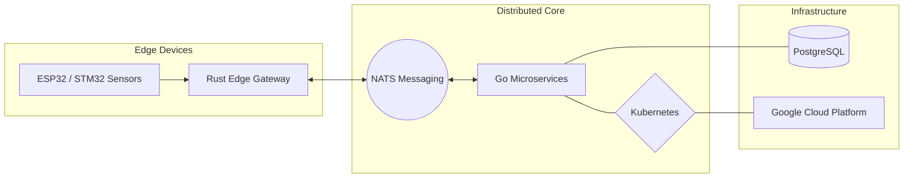
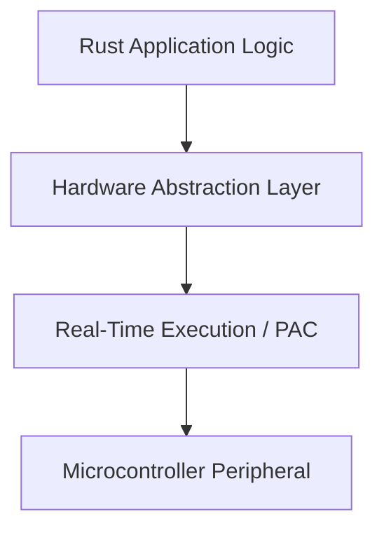

<div align="center">

# ALAIN PALUKU

### ELECTRICAL ENGINEER | EMBEDDED SYSTEMS SOFTWARE DEVELOPER

<br>


<br>

```text
[SYSTEM] Status: ONLINE
[SYSTEM] Mission: Bridging power systems with low-level software engineering
[SYSTEM] Current Focus: High-performance RTOS-like environments for industrial IoT
```

<br>

<p align="center">
  <a href="https://alainpaluku.com">
    
  </a>&nbsp;
  <a href="https://linkedin.com/in/alainpaluku">
    
  </a>&nbsp;
  <a href="https://huggingface.co/alainpaluku">
    
  </a>&nbsp;
  <a href="https://medium.com/@alainpaluku">
    
  </a>&nbsp;
  <a href="mailto:dev@alainpaluku.com">
    
  </a>&nbsp;
  <a href="https://wa.me/243897023743">
    
  </a>
</p>

<details>
<summary><b>QUICK NAVIGATION</b></summary>
<br />
<ul>
  <li><a href="#professional-profile">PROFESSIONAL PROFILE</a></li>
  <li><a href="#academic-background">01. ACADEMIC BACKGROUND & EDUCATION</a></li>
  <li><a href="#technical-expertise">TECHNICAL EXPERTISE</a></li>
  <li><a href="#technological-stack">TECHNOLOGICAL STACK</a></li>
  <li><a href="#system-architectures">02. SYSTEM ARCHITECTURES & DESIGN PATTERNS</a></li>
  <li><a href="#technical-articles">LATEST TECHNICAL ARTICLES</a></li>
  <li><a href="#engineering-projects">FEATURED ENGINEERING PROJECTS</a></li>
  <li><a href="#engineering-metrics">ENGINEERING METRICS & INSIGHTS</a></li>
</ul>
</details>

</div>

---

<table width="100%">
  <tr>
    <td width="65%" valign="top">
      <h3 id="professional-profile">PROFESSIONAL PROFILE</h3>
      <p>
        I am a professional <b>Electrical Engineer</b> and <b>Embedded Systems Software Developer</b>. I am currently pursuing a <b>Master's in Electroenergetics</b> (Power Systems & Renewable Energy) at <i>Université Catholique la Sapientia</i>.
      </p>
      <p>
        My expertise lies at the intersection of <b>High-Power Electrical Infrastructure</b> and <b>Low-Level Software Engineering</b>. I specialize in designing resilient power systems, industrial automation solutions, and high-performance <b>embedded firmware</b> using <b>Rust</b> and <b>Go</b> for the <b>Industrial Internet of Things (IIoT)</b>.
      </p>
      <p align="center">
        <br>
        <a href="https://alainpaluku.com/en/contact/">
          
        </a>&nbsp;&nbsp;
        <a href="https://alainpaluku.com/en/about/">
          
        </a>
      </p>
    </td>
    <td width="35%" align="center">
      
    </td>
  </tr>
</table>

---

<details>
<summary id="academic-background"><b>01. ACADEMIC BACKGROUND & EDUCATION</b></summary>
<br>
<blockquote>
  <b>Master’s in Electroenergetics</b> (In progress)<br/>
  <i>Université Catholique la Sapientia – Goma</i>
</blockquote>
<blockquote>
  <b>Bachelor’s degree in Electrical Engineering</b> (2025)<br/>
  <i>Université Catholique la Sapientia – Goma</i>
</blockquote>
<blockquote>
  <b>State Diploma in Electricity</b> (2021)<br/>
  <i>Institut Kyeshero – Goma</i>
</blockquote>
</details>

---

<h3 id="technical-expertise">TECHNICAL EXPERTISE</h3>

<table width="100%">
  <tr>
    <td align="center" width="33%">
      <b>Energy Systems</b><br/>
      <hr/>
      Sizing LV/MV/HV Networks<br/>
      Hydroelectric Plants<br/>
      Photovoltaic Systems
    </td>
    <td align="center" width="33%">
      <b>Industrial Infrastructure</b><br/>
      <hr/>
      Electrical Installations<br/>
      Safety & Protection<br/>
      Resilient Infrastructure
    </td>
    <td align="center" width="33%">
      <b>Automation & AI</b><br/>
      <hr/>
      Industrial Automation<br/>
      Predictive Maintenance<br/>
      Control Systems
    </td>
  </tr>
</table>

---

<h3 id="technological-stack">TECHNOLOGICAL STACK</h3>

<table width="100%">
  <tr>
    <th align="left">Category</th>
    <th align="left">Technologies & Frameworks</th>
  </tr>
  <tr>
    <td><b>Languages</b></td>
    <td></td>
  </tr>
  <tr>
    <td><b>Embedded & Hardware</b></td>
    <td>
      
      <br/>
      
      
      
    </td>
  </tr>
  <tr>
    <td><b>Web & 3D Ecosystem</b></td>
    <td>
      
    </td>
  </tr>
  <tr>
    <td><b>Infrastructure & Cloud</b></td>
    <td>
      
      <br/>
      
      
      
    </td>
  </tr>
  <tr>
    <td><b>AI & Computer Vision</b></td>
    <td>
      
      <br/>
      
    </td>
  </tr>
</table>

---

<details>
<summary id="system-architectures"><b>02. SYSTEM ARCHITECTURES & DESIGN PATTERNS</b></summary>
<br>

#### DISTRIBUTED IOT ECOSYSTEM


#### EMBEDDED SOFTWARE STACK


</details>

---

<h3 id="technical-articles">LATEST TECHNICAL ARTICLES</h3>

<p align="justify">
  I regularly share technical insights on power systems, industrial automation, and embedded software development. I am currently authoring an in-depth technical piece titled: <i>« Conception d’un système de maintenance prédictive pour moteurs électriques »</i>, focusing on signal processing and AI for industrial reliability.
</p>

<p align="center">
  <a href="https://alainpaluku.com/en/articles/">
    
  </a>
</p>

---

<h3 id="engineering-projects">FEATURED ENGINEERING PROJECTS</h3>

<ul>
  <li><b>Predictive Maintenance System</b>: Developing an open-source hardware/software prototype for industrial electric motors to detect bearing, alignment, and insulation failures via signal processing.</li>
  <li><b>ArchAI-CAD</b>: A web-based SaaS for 3D parametric architectural design driven by Generative AI. Engineered using <b>Maker.js</b> for complex 2D zoning coordinates, seamlessly extruded into 3D volumes via <b>Replicad</b>, powered by SolidJS and WebAssembly.</li>
  <li><b>Embedded Runtime</b>: High-performance RTOS-like environments for STM32 and ESP32 built with Rust, focusing on memory safety and real-time execution for industrial IoT.</li>
  <li><b>Distributed IoT Core</b>: A scalable, cloud-native backend architecture for managing massive device fleets using Go, NATS messaging, and Kubernetes orchestration.</li>
</ul>

---

<h3 id="engineering-metrics">ENGINEERING METRICS & INSIGHTS</h3>

<p align="center">
  
</p>

<p align="center">
  
</p>

<p align="center">
  
  
</p>

<p align="center">
  
</p>

<p align="center">
  
</p>

---

<div align="center">
  
</div>
```
