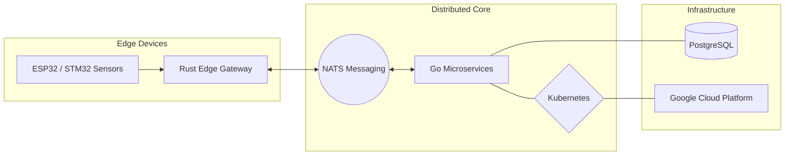
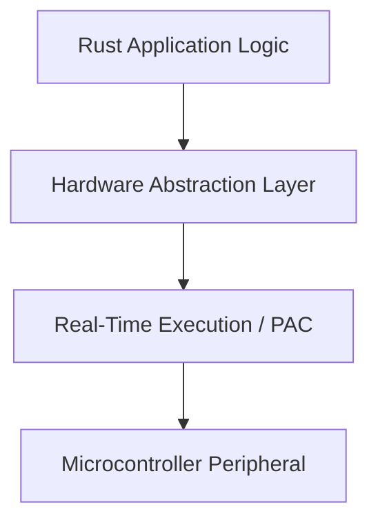

<div align="center">

# ALAIN PALUKU

### ELECTRICAL ENGINEER | EMBEDDED SYSTEMS SOFTWARE DEVELOPER

<br>


<br>

```text
[SYSTEM] Status: ONLINE
[SYSTEM] Mission: Bridging power systems with low-level software engineering
[SYSTEM] Current Focus: High-performance RTOS-like environments for industrial IoT
```

<br>

[](https://alainpaluku.com)
[](https://linkedin.com/in/alainpaluku)
[](https://huggingface.co/alainpaluku)
[](https://medium.com/@alainpaluku)
[](mailto:dev@alainpaluku.com)

</div>

---

### About Me

I am an **Electrical Engineer** currently pursuing a **Master's in Electroenergetics** at *Université Catholique la Sapientia*. My work bridges the gap between high-power electrical systems and low-level software engineering. I specialize in designing resilient power infrastructures, industrial automation, and high-performance embedded systems using **Rust** and **Go**.

---

<details>
<summary><b>Academic Background</b></summary>
<br>

- **Master’s in Electroenergetics** (In progress)
  *Université Catholique la Sapientia – Goma*
- **Bachelor’s degree in Electrical Engineering** (2025)
  *Université Catholique la Sapientia – Goma*
- **State Diploma in Electricity** (2021)
  *Institut Kyeshero – Goma*

</details>

---

### Expertise

<div align="center">

| **Energy** | **Industry** | **Automation** |
| :--- | :--- | :--- |
| Sizing of LV, MV & HV networks | Industrial electrical installations | Industrial automation solutions |
| Hydroelectric power plants | Safety & protection solutions | Monitoring & predictive maintenance |
| Photovoltaic systems | Resilient infrastructure | Control systems |

</div>

---

### Technical Stack

| Category | Tools & Technologies |
| :--- | :--- |
| **Languages** |  |
| **Embedded & Hardware** |  <br>    |
| **Infrastructure & Cloud** |  <br>    |
| **AI & Computer Vision** |  <br>  |

---

<details>
<summary><b>System Architectures & Design Patterns</b></summary>
<br>

#### Distributed IoT Ecosystem


#### Embedded Software Stack


</details>

---

### Featured Projects

- **Embedded Runtime**: High-performance RTOS-like environments for STM32 and ESP32 built with Rust, focusing on memory safety and real-time execution for industrial IoT.
- **Distributed IoT Core**: A scalable, cloud-native backend architecture for managing massive device fleets using Go, NATS messaging, and Kubernetes orchestration.
- **AI CAD Engine**: An intelligent system leveraging Python, PyTorch, and Computer Vision to automate the analysis of complex electrical schematics and optimize CAD workflows.
- **Native Engineering UI**: High-fidelity mobile dashboards developed with Kotlin and Swift, providing real-time telemetry and control for industrial power systems.

---

### Certifications & Publications

- **Certifications**: Focus on Power Systems, IoT Security, and Rust Development.
- **Articles**: Technical insights on energy and industry (available on my [website](https://alainpaluku.com/en/articles/)).

---

### Interests

- **Renewable Energy**: Passionate about the transition to sustainable power grids.
- **Open Source**: Contributing to the Rust and IoT communities.
- **Space Exploration**: Following advancements in aerospace engineering and satellite communications.

---

### Terminal Session

```bash
$ alain-paluku --query status
> INITIALIZING CORE SYSTEMS...
> LOADING ELECTRICAL SCHEMATICS [OK]
> COMPILING RUST EMBEDDED KERNEL [OK]
> SYNCHRONIZING WITH DISTRIBUTED CLUSTER [OK]
> CURRENT_STATE: READY_FOR_CHALLENGE
```

---

### Engineering Metrics

<div align="center">

[](https://github.com/ryo-ma/github-profile-trophy)

<br>


<br>


<br>


<br>


</div>

---

<div align="center">


</div>
